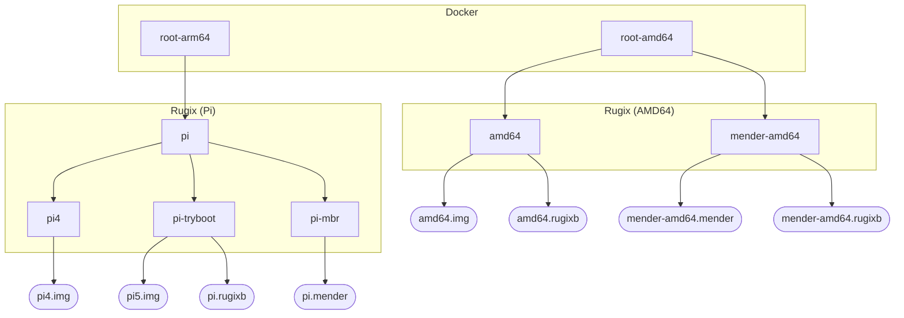

# umbrelOS


## Build Process

The following diagram visualizes the build process and various build artifacts:



### OS Variants

There are three main umbrelOS *variants*:

- `umbrelos-pi`: Rugix-native umbrelOS for Raspberry Pi.
- `umbrelos-amd64`: Rugix-native umbrelOS for AMD64.
- `umbrelos-mender-amd64`: Rugix-based but Mender-compatible umbrelOS for AMD64.

> [!IMPORTANT]
> **Legacy devices provisioned with Mender require the `umbrelos-mender-amd64` variant.** This variant includes a Rugix configuration to enable a safe migration from Mender to Rugix. Rugix will interface with GRUB in the same way Mender does to facilitate A/B switching. In addition, a Rugix hook is installed to migrate state into Rugix's state management mechanism. This enables factory resets and all other Rugix state management features.

### Build Artifacts

The build process produces the following artifacts.

#### Images

Images for provisioning new umbrelOS devices.

- `umbrelos-amd64.img`: Image for provisioning AMD64 devices and VMs.
- `umbrelos-pi4.img`: Image for provisioning Raspberry Pi 4 devices (GPT-based).
- `umbrelos-pi5.img`: Image for provisioning Raspberry Pi 5 devices (GPT-based).

The image for Raspberry Pi 4 includes a firmware update to enable the `tryboot` mechanism used for A/B switching. Otherwise, the image is identical to the image for Raspberry Pi 5.

#### Mender Update Artifacts

Mender update artifacts for updating existing systems through Mender:

- `umbrelos-pi.mender`: Mender update artifact for Raspberry Pi.
- `umbrelos-mender-amd64.mender`: Mender update artifact for AMD64 devices.

The update artifact for Raspberry Pi works for Raspberry Pi 4 and 5.

#### Rugix Update Bundles

For each of the umbrelOS variants, there is a respective Rugix update bundle:

- `umbrelos-pi.rugixb`: Rugix update bundle for Raspberry Pi.
- `umbrelos-amd64.rugixb`: Rugix update bundle for Rugix-native AMD64 devices.
- `umbrelos-mender-amd64.rugixb`: Rugix update bundle for legacy Mender devices.


## Mender to Rugix Migration

Devices can be migrated to Rugix by installing the respective Mender update artifact.

### Raspberry Pi

As umbrelOS for Raspberry Pi has always been based on Rugix, no special migration is needed.

### AMD64

In case of Mender-based AMD64 devices, the directory structure on the data partition must be migrated such that Rugix's state management can be used.
This migration is performed by a `boot/post-init` Rugix hook: [`10-migrate-state.sh`](./rugix/recipes/setup-rugix-mender/files/migrate-state.sh).
This hook works as follows: Initially, a symlink `/data/umbrel-os` is placed in the `/data` directory managed by Rugix linking back to the bare data partition.
This way, after booting, all the bind mounts to `/data/umbrel-os` are set up correctly.
The migration hook replaces this symlink atomically with the directory from the data partition, **but only after the system has been committed**.
This is done to leave the state intact, in case there is a rollback.
Note that the system needs to be rebooted once after the commit to trigger the migration.
To this end, after committing, `umbreld` may check whether `/data/umbrel-os` is a symlink and reboot the system if it is.


## Factory Resets

Factory resets can be triggered through Rugix Ctrl's state management mechanism as usual.
To trigger a factory reset, run `rugix-ctrl state reset`.
This will reboot the system and remove the state on the data partition in the process.
In case of a RAID configuration, a [`state-reset/prepare` hook](./rugix/recipes/setup-rugix/files/factory-reset.sh) is used to remove the RAID configuration and reset the main data partition.
Note that Rugix only supports resetting the state on the actively used data partition (which is the RAID, if a RAID has been configured), hence, we need to use the hook here to make sure that the main data partition is wiped as well.

Removing state can take some time during the boot process.
It is therefore recommended to use Rugix's state reset mechanism with the `--backup` flag.
This will simply rename the old state directory according to the following pattern:

```
/run/rugix/mounts/data/state/default -> /run/rugix/mounts/data/state/default.XXXXXXXXXXXXXX
```

Here, `XXXXXXXXXXXXXX` is the date and time of the reset.
The residual state can then removed after booting by `umbreld`.
